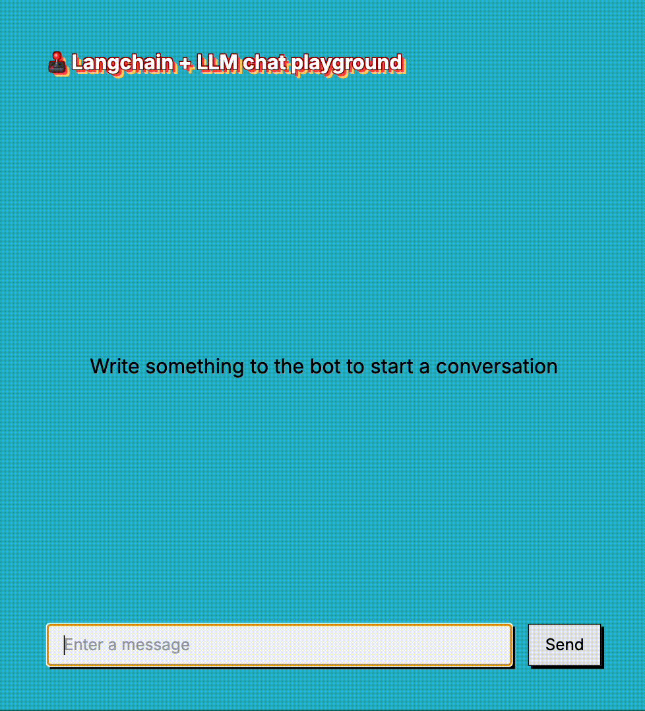

Tired with the default GPTs chats? This one has sarcasm per default!



This project is a playground UI for Large Language Modals (LLMs). It utilizes:
- [LangChain.js](https://github.com/langchain-ai/langchainjs) for model call abstraction and Retrieval-Augmented Generation (RAG)
- [React](https://github.com/facebook/react) and [Next.js](https://github.com/vercel/next.js) for UI and server

## Prerequisites

To run this project you need
- [Node.js®](https://nodejs.org/en/download/package-manager) v20+
- [pnpm](https://pnpm.io/installation) 9+
- [Ollama](https://ollama.com/download)

## Run locally

This playground supports a locally running Ollama server and the HuggingFace Inference API. Per default the chat will use
Ollama with llama3.1 model. If it is the first time you are using the configured model, Ollama will download it when
you send the first message in the conversation UI without any visible progress. You should pull the model first:

```bash
ollama pull llama3.1
```

You can also run a model deployed on [Hugging Face](https://huggingface.co/) by configuring an
[access token](https://huggingface.co/docs/hub/security-tokens), see [configuration options](#configuring-the-playground)

To start the application in development mode run:

```bash
pnpm install
pnpm dev
```

Open [http://localhost:3000](http://localhost:3000) in your browser to see the result.

## Configuring the Playground

The playground can be customized via environment variables, with default settings defined in the [`.env`](.env) file.
To configure the playground for a local development environment, simply copy the contents of `.env` to a new file named
`.env.local`, and update the values as needed. This file is excluded from version control.

| Configuration variable      | Description                                         | Default value                             |
|-----------------------------|-----------------------------------------------------|-------------------------------------------|
| SYSTEM_MESSAGE              | System message that defines the behaviour of the AI | You are a helpful but sarcastic assistant |
| OLLAMA_MODEL                | The model used by local Ollama server               | llama3.1                                  |
| HUGGINGFACEHUB_MODEL        | Hugging Face model                                  | microsoft/Phi-3-mini-4k-instruct          |
| HUGGINGFACEHUB_API_KEY      | Hugging Face access token                           |                                           |
| HUGGINGFACEHUB_ENDPOINT_URL | Hugging Face inference endpoint url                 |                                           |

